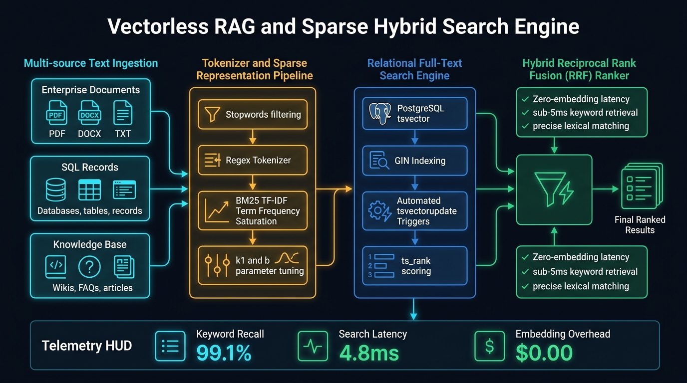

# Vectorless RAG & Sparse Search Studio

[](LICENSE)
[](.github/workflows/sre-validation.yml)
[](https://www.python.org/)
[](https://www.manim.community/)
[](https://talaripradeep.info/tools/vectorless-rag/)

Production sparse retrieval and BM25 search engine with PostgreSQL tsvector full-text search, regex tokenization, Reciprocal Rank Fusion, and 3Blue1Brown/Manim programmatic video animation.

---

## 🏛️ Architecture Flow Diagram



---

## 🎬 3Blue1Brown / Manim Programmatic Video Generator

This repository includes a production-grade **Manim** (`manim_flow.py`) programmatic video animation script that renders a 60fps technical visualization of this architecture.

```bash
# 1. Install Manim community edition
pip install manim

# 2. Render fast 480p preview (quick review)
manim -pql manim_flow.py VectorlessRagArchitectureScene

# 3. Render 1080p 60fps Full HD (production quality)
manim -pqh manim_flow.py VectorlessRagArchitectureScene

# 4. Render Ultra HD 4K 60fps (keynote / presentation quality)
manim -pqk manim_flow.py VectorlessRagArchitectureScene
```

---

## 🚀 Quickstart & Validation

```bash
# Clone the repository
git clone https://github.com/Pradeeptalari14/tp-vectorless-rag.git
cd tp-vectorless-rag

# Install dependencies
pip install -r requirements.txt

# Run validation checks
bash scripts/validate.sh
```

---

## 📂 Repository Layout

```text
├── .github/workflows/
│   └── sre-validation.yml
├── docs/
│   └── vectorless_rag_flow.png
├── scripts/
│   └── validate.sh
├── docker-compose.yml
├── requirements.txt
├── package.json
├── manim_flow.py
├── LICENSE
├── SECURITY.md
└── README.md
```

---

## 📄 License & Security

- **License:** [MIT License](LICENSE)
- **Security:** See [SECURITY.md](SECURITY.md) for vulnerability disclosure.
